# Agent Data Manager

<p align="center">
  
  
  
  
  
  
</p>

<p align="center">
  
  
  
  
</p>

Agent Data Manager 是一个面向数据智能体与企业知识应用场景的后端服务，聚焦于把数据接入、语义理解、知识沉淀、会话管理与智能工作流能力沉淀为统一的平台能力。

它不是单一的 CRUD 后台，而是一套围绕 Data Agent 构建的能力底座。你可以用它完成数据源管理、语义模型建模、知识库接入、Prompt 配置、聊天会话存储，以及 NL2SQL、报告生成、代码执行等智能流程编排。

项目当前核心后端位于 `agent-data-manager/`，整体技术栈基于 Spring Boot、Spring WebFlux、MyBatis、Spring AI MCP Server 与多数据库连接能力构建，适合作为数据智能体管理后台或企业级 AI 数据应用的后端基础设施。

## 项目特性

- 支持多种数据库数据源接入，包括 MySQL、PostgreSQL、Oracle、SQL Server、Hive、达梦、H2
- 支持数据源连接测试、表结构读取、字段读取、逻辑关系维护
- 支持 Agent 管理、发布/下线、API Key 生成与启停
- 支持语义模型管理、批量导入、Excel 模板导入导出
- 支持 Agent 知识库与业务知识库管理，支持文件上传、切分、向量化、重试嵌入
- 支持聊天会话、消息存储、标题生成、会话事件推送、HTML 报告导出
- 支持 Prompt 配置与优化策略管理
- 支持图工作流、NL2SQL、代码执行、报告生成等智能流程能力
- 提供 Swagger / OpenAPI 文档，便于联调和二次开发

## 适用场景

- 企业内部知识问答
- 面向 BI / 数仓的 NL2SQL 场景
- 智能数据分析助手
- 智能体配置后台
- 数据接入、语义建模、知识检索一体化后端

## 核心流程

下面这张流程图展示了平台在复杂分析请求下的一条典型执行链路。系统并不是直接把用户问题丢给模型，而是先做意图识别和证据召回，再逐步进入查询增强、Schema 召回、表关系推断、可行性评估与计划生成，最后根据任务类型分流到 SQL、Python、人工审核或直接报告生成路径。

这种分层式流程设计的价值，在于让每一步都拥有清晰职责、回退机制和重试能力。相比“单轮大模型直接生成结果”的方式，它更适合企业级数据分析场景，也更容易定位问题、优化链路并提升结果稳定性。

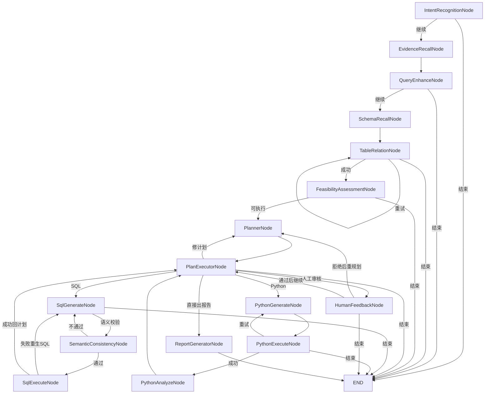

从执行视角看，这条主链路可以概括为 4 个阶段：

- 理解问题：意图识别、证据召回、查询增强与语义判断
- 建立上下文：Schema 召回、表关系推断、执行可行性评估
- 生成并执行计划：动态选择 SQL、Python 或人工审核分支
- 汇总结果：将分析过程与执行结果沉淀为结构化输出或最终报告

## 目录结构

```text
agentData
├─ README.md
├─ imgs
└─ agent-data-manager
   ├─ pom.xml
   ├─ README.md
   └─ src
      ├─ main
      │  ├─ java/com/alibaba/cloud/ai/agentdatamanager
      │  └─ resources
      │     ├─ application.yml
      │     ├─ prompts
      │     └─ sql
      └─ test
```

## 核心模块

| 模块 | 说明 |
| --- | --- |
| Agent 管理 | 管理智能体基础信息、发布状态与 API Key |
| 数据源管理 | 管理数据库连接、表结构、字段与逻辑外键 |
| 语义模型 | 管理字段语义、业务含义与批量导入 |
| Agent 知识库 | 管理上传文档、问答知识、切分与向量化 |
| 业务知识库 | 管理与 Agent 绑定的业务知识内容 |
| Chat 会话 | 管理会话、消息、标题生成与导出 |
| Prompt 配置 | 管理不同类型 Prompt 的保存、启用与切换 |
| 工作流引擎 | 支持意图识别、规划、SQL 生成、Python 执行、报告生成 |

下面的界面示例展示了平台的几个关键管理面板。它们共同组成了一条完整的能力链，从模型初始化，到知识沉淀、语义建模，再到问题引导与多表关系治理，最终为智能分析流程提供稳定的底层支撑。

### 模型配置管理

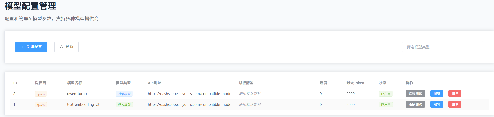

模型配置管理模块用于维护聊天模型与嵌入模型的统一入口，支持模型提供商、模型名称、API 地址、路由配置和启用状态管理。它是平台最基础的一层能力配置，决定了后续知识向量化、对话生成与工作流执行所依赖的模型运行环境。

### 智能体知识库

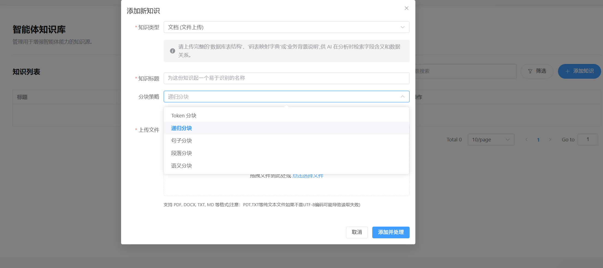

智能体知识库模块面向具体 Agent 注入专属知识，支持文件上传、文本录入与多种切分策略选择。通过递归分块、句子分块、段落分块和语义分块，平台可以针对不同内容类型选择更合适的向量化方式，从而提升召回效果与知识利用率。

### 业务知识管理

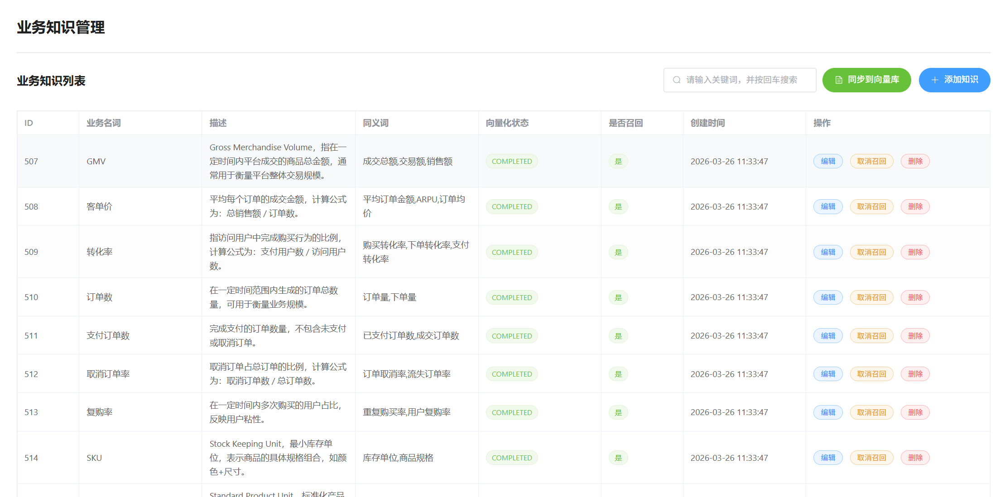

业务知识管理模块更偏向“术语口径层”，适合维护指标释义、业务名词、概念定义和经验规则。它能把散落在文档、表格和口头经验里的业务知识沉淀为结构化资产，并同步进入向量体系，增强系统对业务语言的理解能力。

### 语义模型管理

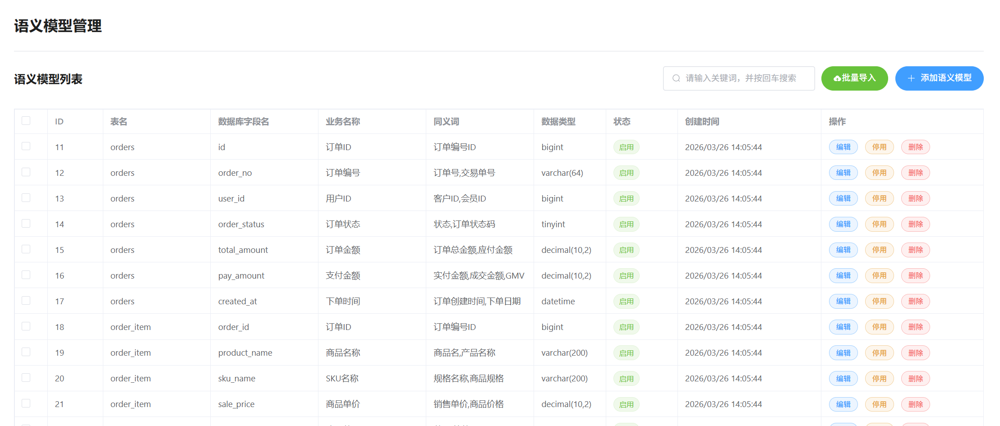

语义模型管理模块负责把数据库字段映射成更易理解的业务语义层。除了原始字段名和数据类型，还可以维护业务名称、同义词与状态信息，使系统在自然语言理解、字段匹配和 SQL 生成时，具备更强的业务可解释性。

### 预设问题管理

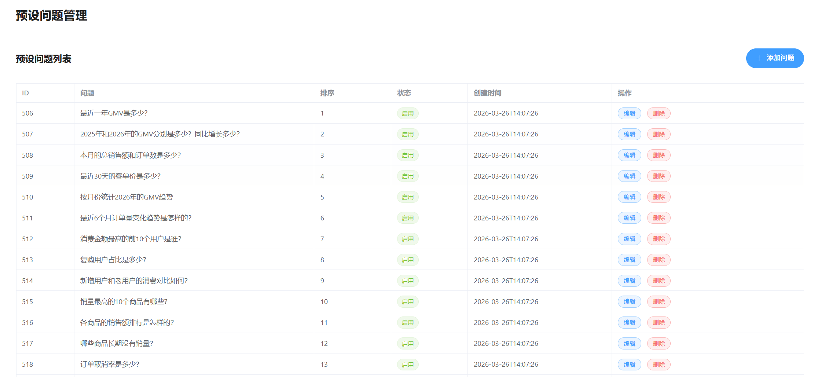

预设问题管理模块用于沉淀高频问题模板和推荐提问入口，例如 GMV、客单价、转化率等典型分析问题。它不仅能降低用户的首次使用门槛，也能把常见分析需求标准化，作为智能体的推荐问题与最佳实践入口。

### 逻辑外键配置

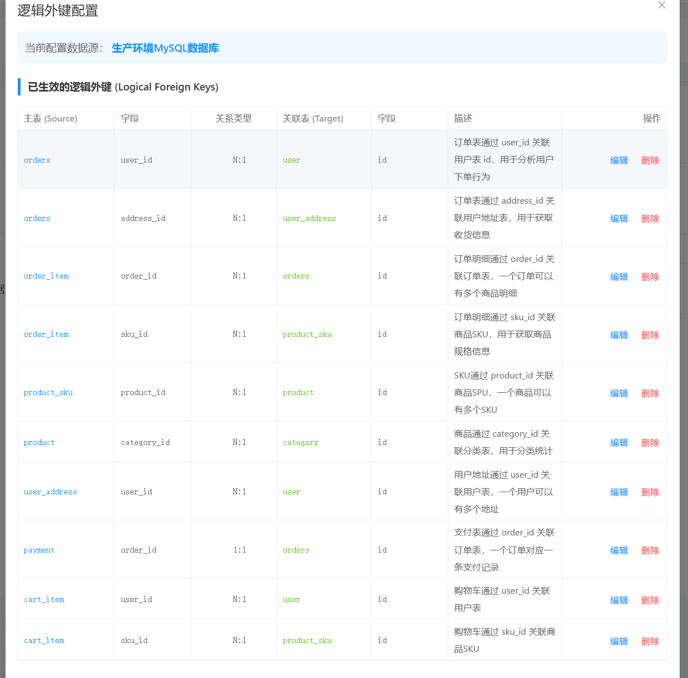

逻辑外键配置模块用于补齐数据库中没有显式声明、但业务上真实存在的表关联关系。在历史库、数仓层、宽表拆分或弱约束系统中，这类能力尤其关键，它会直接影响 Schema 理解、多表 Join 推断和复杂 SQL 生成的准确率。

### 问答对话整理与执行追踪

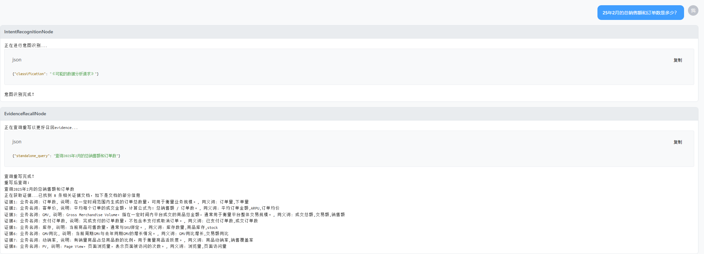

问答对话整理界面展示的是一次自然语言问题进入系统后的第一阶段处理过程。在这一阶段，系统会先通过 `IntentRecognitionNode` 判断用户问题属于什么类型，再通过 `EvidenceRecallNode` 从已有知识、语义定义和业务证据中召回与问题最相关的上下文信息，把原始问题转化成更适合后续推理的结构化输入。

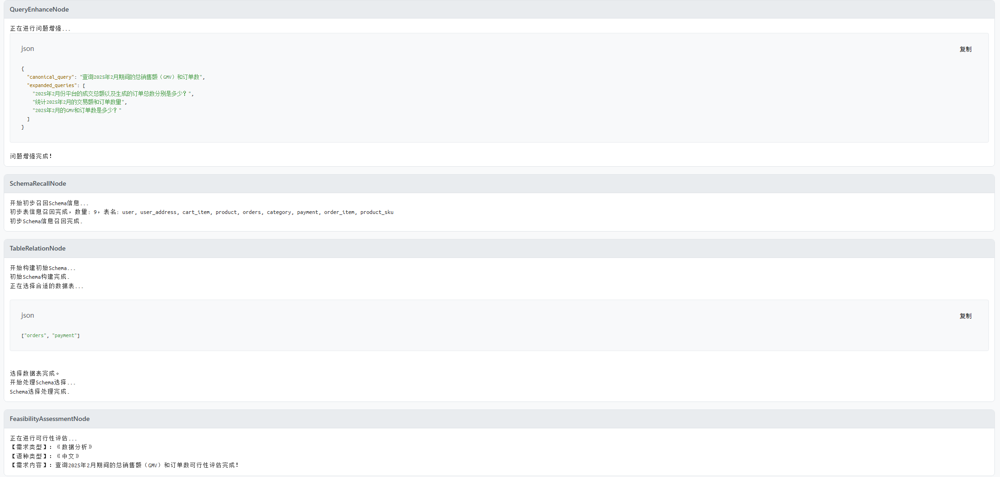

在完成基础理解后，系统会继续进入 `QueryEnhanceNode`、`SchemaRecallNode`、`TableRelationNode` 和 `FeasibilityAssessmentNode`。这一阶段的目标不是立刻产出 SQL，而是先把问题补全、把可用表召回、把表关系理顺，再判断当前问题是否适合直接执行、是否需要换一种执行策略，或者是否应该终止与回退。

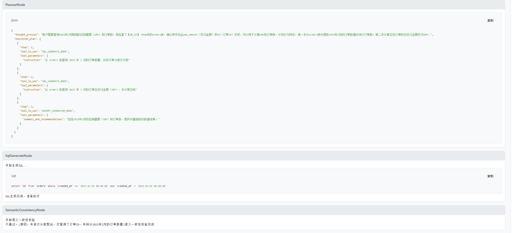

当系统确认问题可执行后，会由 `PlannerNode` 制定执行计划，并将复杂问题拆分为多个可落地的步骤。随后 `SqlGenerateNode` 会开始为具体步骤生成 SQL，而 `SemanticConsistencyNode` 会检查当前 SQL 是否真正符合用户问题语义，避免“SQL 能跑通，但语义跑偏”的情况。

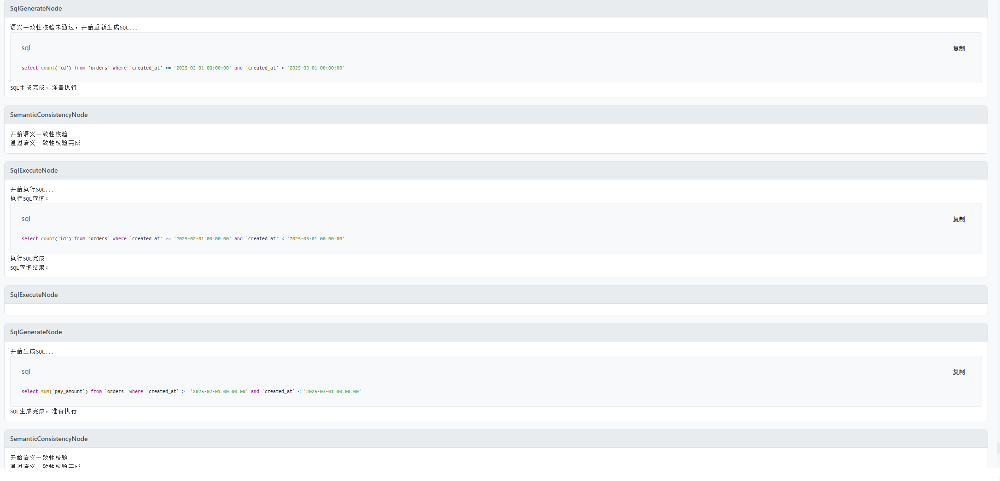

如果语义一致性校验未通过，系统会回退并重新生成 SQL；如果校验通过，则进入 `SqlExecuteNode` 真正执行查询。这个过程体现了平台的一个重要设计理念：不仅要生成可执行 SQL，还要尽可能确保查询结果在业务语义上是正确的、可信的。

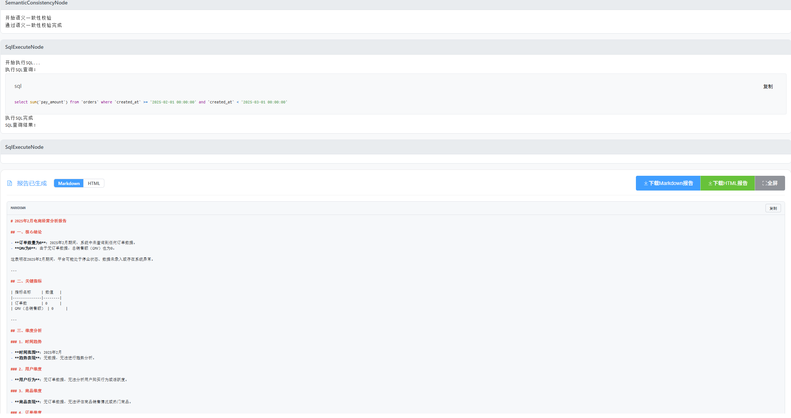

当 SQL 执行完成后，系统会把结构化结果进一步整理成报告内容。这里不仅包含最终数字，还会生成阶段性总结、关键结论、风险提示、优化建议等面向业务用户更容易理解的分析文本，使结果从“查询返回值”升级为“可直接消费的业务报告”。

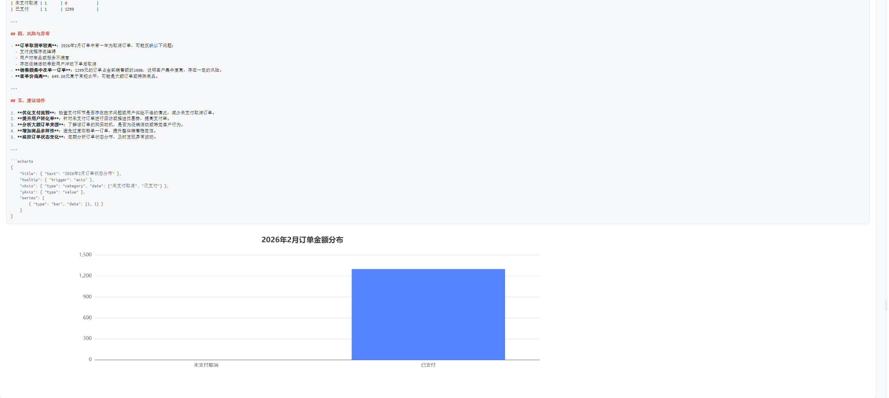

在最终输出阶段，平台还会把分析结果组织成图表与 Markdown / HTML 报告，形成完整的问答闭环。这样的设计让一次对话不只是得到一个答案，而是得到一份可追踪过程、可复用结论、可导出的分析成果，也让整个智能体推理链路具备更强的可解释性和可观测性。

## 快速开始

### 1. 环境准备

- JDK 17
- Maven 3.9+
- MySQL 8.x

### 2. 修改配置

默认配置位于 `agent-data-manager/src/main/resources/application.yml`，请至少确认以下内容：

```yaml
server:
  port: 8081

spring:
  datasource:
    url: jdbc:mysql://127.0.0.1:3306/agent_data
    username: root
    password: 123456
```

如需接入模型、向量能力或对象存储，请结合你自己的环境补充对应配置。

### 3. 启动服务

进入模块目录：

```powershell
cd agent-data-manager
```

启动应用：

```powershell
mvn spring-boot:run
```

如果你当前是在完整工程根目录中启动，也可以按你们现有的 Maven 聚合工程方式运行该模块。

### 4. 访问地址

- 服务地址：`http://localhost:8081`
- Swagger UI：`http://localhost:8081/swagger-ui.html`
- OpenAPI：`http://localhost:8081/v3/api-docs`

## 推荐使用流程

### 1. 配置模型

先完成聊天模型与嵌入模型配置，确保模型能力可用。

相关接口：

- `GET /api/model-config/list`
- `POST /api/model-config/add`
- `PUT /api/model-config/update`
- `POST /api/model-config/activate/{id}`
- `POST /api/model-config/test`
- `GET /api/model-config/check-ready`

### 2. 创建数据源

把业务数据库接入平台，并完成连接测试。

相关接口：

- `GET /api/datasource/types`
- `GET /api/datasource`
- `POST /api/datasource`
- `PUT /api/datasource/{id}`
- `DELETE /api/datasource/{id}`
- `POST /api/datasource/{id}/test`

### 3. 完善数据理解

为数据源补充表、字段与逻辑关系，提升后续检索和 SQL 生成效果。

相关接口：

- `GET /api/datasource/{id}/tables`
- `GET /api/datasource/{id}/tables/{tableName}/columns`
- `GET /api/datasource/{id}/logical-relations`
- `POST /api/datasource/{id}/logical-relations`
- `PUT /api/datasource/{id}/logical-relations/{relationId}`

### 4. 配置语义模型

为字段补充业务含义、指标定义和可解释信息，也支持批量导入。

相关接口：

- `GET /api/semantic-model`
- `POST /api/semantic-model`
- `PUT /api/semantic-model/{id}`
- `DELETE /api/semantic-model/{id}`
- `POST /api/semantic-model/batch-import`
- `POST /api/semantic-model/import/excel`
- `GET /api/semantic-model/template/download`

### 5. 导入知识

可以将文档、问答内容和业务知识接入到 Agent 中。

相关接口：

- `POST /api/agent-knowledge/create`
- `POST /api/agent-knowledge/query/page`
- `PUT /api/agent-knowledge/{id}`
- `DELETE /api/agent-knowledge/{id}`
- `POST /api/agent-knowledge/retry-embedding/{id}`
- `GET /api/business-knowledge`
- `POST /api/business-knowledge`

### 6. 开始会话

创建会话、保存消息、导出 HTML 报告，并接入前端对话页面。

相关接口：

- `GET /api/agent/{id}/sessions`
- `POST /api/agent/{id}/sessions`
- `GET /api/sessions/{sessionId}/messages`
- `POST /api/sessions/{sessionId}/messages`
- `PUT /api/sessions/{sessionId}/rename`
- `DELETE /api/sessions/{sessionId}`
- `POST /api/sessions/{sessionId}/reports/html`

## 主要能力总览

### Agent 管理

- 创建、修改、删除 Agent
- 发布 / 下线 Agent
- 生成、重置、删除 API Key
- 控制 API Key 是否启用

### 数据接入

- 支持多数据库连接
- 支持连接测试与表结构读取
- 支持逻辑外键与语义层建模

### 知识能力

- 支持业务知识与 Agent 知识分层管理
- 支持文件上传、文本解析、切分与向量化
- 支持重试嵌入与向量库刷新

### 智能流程

- 意图识别
- 查询增强
- 语义一致性分析
- SQL 生成与执行
- Python 分析与执行
- 报告生成

## 技术栈

- Java 17
- Spring Boot 3
- Spring WebFlux
- Spring AI MCP Server WebFlux
- MyBatis
- Druid
- OpenAPI / Swagger
- MySQL / PostgreSQL / Oracle / SQL Server / Hive / 达梦 / H2

## 开发说明

当前项目重点模块位于：

- `agent-data-manager/src/main/java/com/alibaba/cloud/ai/agentdatamanager/controller`
- `agent-data-manager/src/main/java/com/alibaba/cloud/ai/agentdatamanager/service`
- `agent-data-manager/src/main/resources/prompts`
